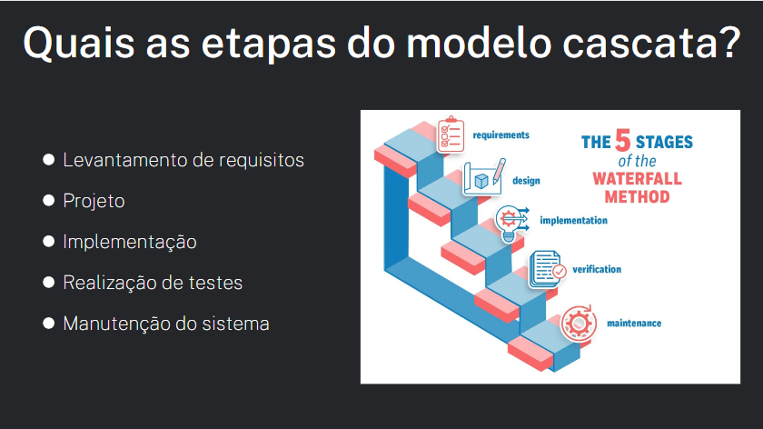

# Unidade 1

A entrega da Unidade 1 é composta pelos seguintes itens:

- [Processo e Ciclo de Vida do Cascata](#modelo-cascata)
- [Vídeo de Aprensentação](#vídeo-de-apresentação)

# Modelo Cascata

### Título

### Como Surgiu?

### O que é o Processo Cascata?

### Etapas do Modelo Cascata

### Especificação de Requisitos

### Projeto

### Implementação

### Teste

### Implementação e Manutenção

### Por qual motivo usar o Cascata?

### Principais Problemas

### Bibliografia

### Agradecimentos

# Vídeo de Apresentação
<iframe width="901" height="507" src="https://www.youtube.com/embed/zsjAa8XgW68" title="Vídeo de apresentação Unidade 1 Requisitos" frameborder="0" allow="accelerometer; autoplay; clipboard-write; encrypted-media; gyroscope; picture-in-picture" allowfullscreen></iframe>